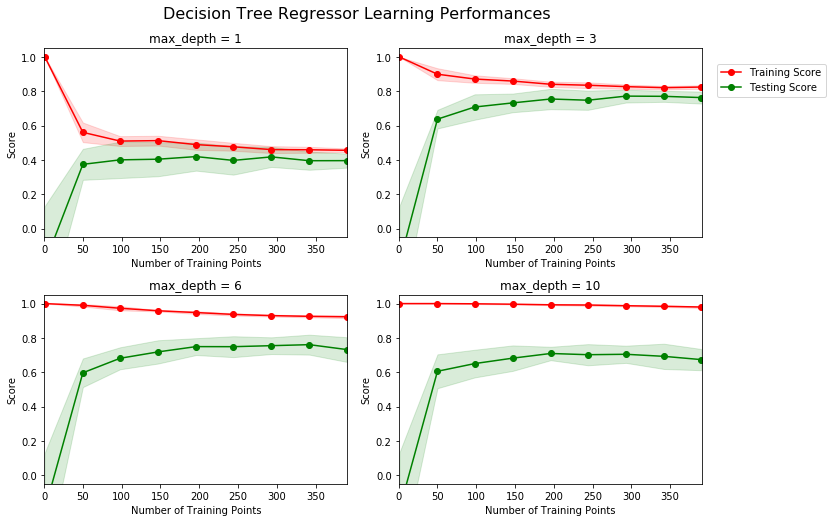

# Machine Learning Engineer Nanodegree
# Model Evaluation and Validation
## Project: Predicting Boston Housing Prices

## Project Overview
In this project, you will apply basic machine learning concepts on data collected for housing prices in the Boston, Massachusetts area to predict the selling price of a new home. You will first explore the data to obtain important features and descriptive statistics about the dataset. Next, you will properly split the data into testing and training subsets, and determine a suitable performance metric for this problem. You will then analyze performance graphs for a learning algorithm with varying parameters and training set sizes. This will enable you to pick the optimal model that best generalizes for unseen data. Finally, you will test this optimal model on a new sample and compare the predicted selling price to your statistics.

## Project Highlights
This project is designed to get you acquainted to working with datasets in Python and applying basic machine learning techniques using NumPy and Scikit-Learn. Before being expected to use many of the available algorithms in the sklearn library, it will be helpful to first practice analyzing and interpreting the performance of your model.

Things you will learn by completing this project:

- How to use NumPy to investigate the latent features of a dataset.
- How to analyze various learning performance plots for variance and bias.
- How to determine the best-guess model for predictions from unseen data.
- How to evaluate a model's performance on unseen data using previous data.

## Description
The Boston housing market is highly competitive, and you want to be the best real estate agent in the area. To compete with your peers, you decide to leverage a few basic machine learning concepts to assist you and a client with finding the best selling price for their home. Luckily, you\'ve come across the Boston Housing dataset which contains aggregated data on various features for houses in Greater Boston communities, including the median value of homes for each of those areas. Your task is to build an optimal model based on a statistical analysis with the tools available. This model will then be used to estimate the best selling price for your clients\' homes.


### Install

This project requires **Python** and the following Python libraries installed:

- [NumPy](http://www.numpy.org/)
- [Pandas](http://pandas.pydata.org/)
- [matplotlib](http://matplotlib.org/)
- [scikit-learn](http://scikit-learn.org/stable/)

You will also need to have software installed to run and execute a [Jupyter Notebook](http://ipython.org/notebook.html)

If you do not have Python installed yet, it is highly recommended that you install the [Anaconda](http://continuum.io/downloads) distribution of Python, which already has the above packages and more included. 

### Code

Template code is provided in the `boston_housing.ipynb` notebook file. You will also be required to use the included `visuals.py` Python file and the `housing.csv` dataset file to complete your work. While some code has already been implemented to get you started, you will need to implement additional functionality when requested to successfully complete the project. Note that the code included in `visuals.py` is meant to be used out-of-the-box and not intended for students to manipulate. If you are interested in how the visualizations are created in the notebook, please feel free to explore this Python file.

### Run

In a terminal or command window, navigate to the top-level project directory `boston_housing/` (that contains this README) and run one of the following commands:

```bash
ipython notebook boston_housing.ipynb
```  
or
```bash
jupyter notebook boston_housing.ipynb
```

This will open the Jupyter Notebook software and project file in your browser.

### Data

The modified Boston housing dataset consists of 489 data points, with each datapoint having 3 features. This dataset is a modified version of the Boston Housing dataset found on the [UCI Machine Learning Repository](https://archive.ics.uci.edu/ml/datasets/Housing).

**Features**
1.  `RM`: average number of rooms per dwelling
2. `LSTAT`: percentage of population considered lower status
3. `PTRATIO`: pupil-teacher ratio by town

**Target Variable**
4. `MEDV`: median value of owner-occupied homes


### Model Performance
